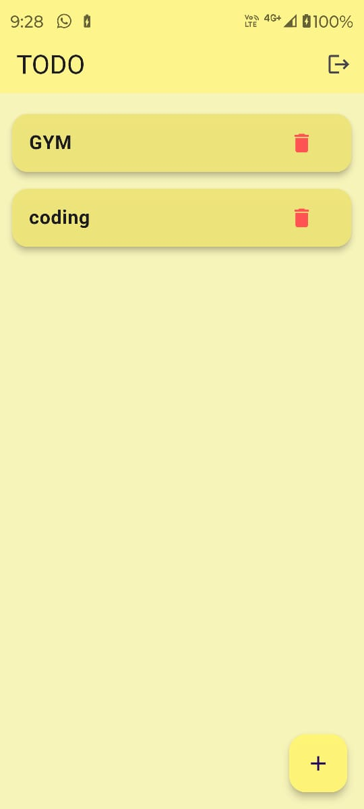
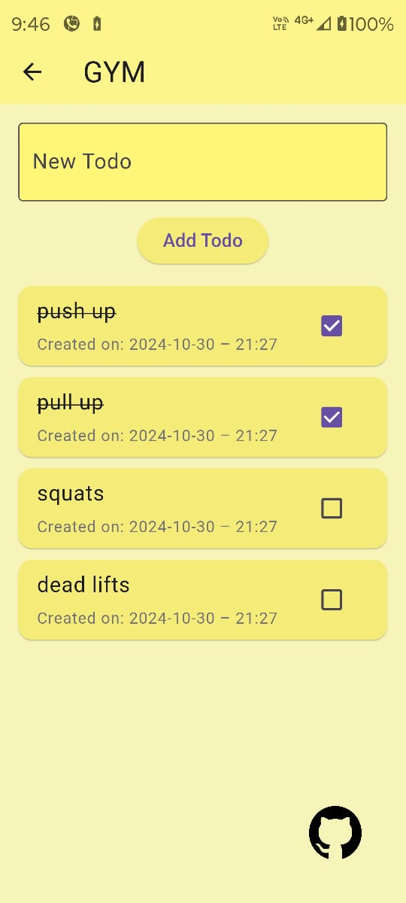
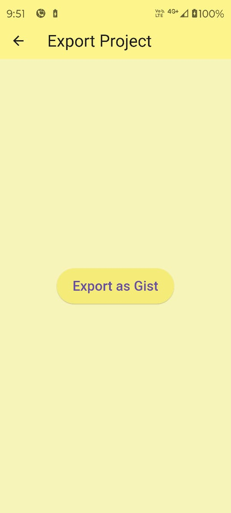
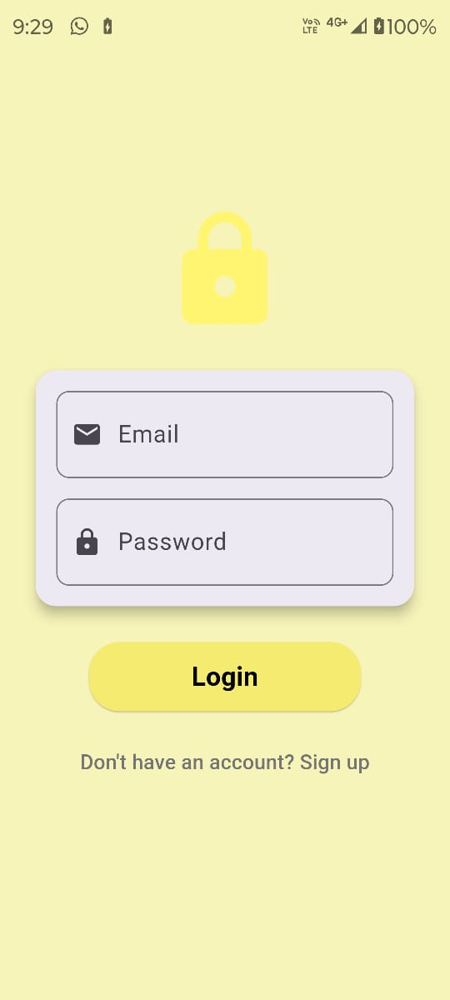
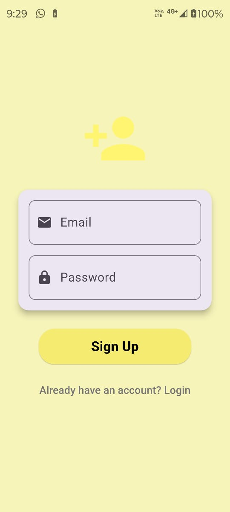

# todo_with_back_end
 
Developed an application to manage todos with the following capabilities:
1. Create a new project.
2. Manage todos within a project (Add, Edit, Update, and Mark as complete).
3. Export the project summary as a gist on GitHub.

# RELEASE APK IS FOR ANDRIOD IS PROVIDED IN GITHUB RELEASE IN THIS REPO 

Star⭐ the repo if you like what you see😉.

## Export as Gist

## Screenshots

<table border>
    <tr>
        <th style="text-align:center">Home</th>
        <th style="text-align:center">PROJECT</th>
        <th style="text-align:center">EXPORT</th>
        <th style="text-align:center">LOGIN</th>
    </tr>
    <tr>
        <td></td>
        <td></td>
        <td></td>
        <td></td>
    </tr>
</table>

<table border>
    <tr>
        <th style="text-align:center">REGISTER</th>
    </tr>
    <tr>
        <td></td>
    </tr>
</table>

## Features Includes:  

1. Selected schema/representation should include:
  a. Project: Unique Id, Title, Created Date, List of Todos.
  b. Todo: Unique Id, Description, Status, Created Date, Updated Date.
2. Basic Auth for user login.
3. Home page provisions:
a. Create a new project.
b. List all projects.
c. View a project.
4. Detailed project view should include:
a. Project title (Editable).
b. List of todos with description, date, and completion status.
c. Actions to Add/Update/Remove a todo.
d. Mark a todo as pending or complete.
e. Action to export summary as a secret gist.
5. Application should save the exported gist file to the local system (as markdown).
6. Adherence to proper code conventions and style guide (package, names,
indentation, etc.).
7. Secret gist template/format example provided.
 
## ✨ Requirements

* Any Operating System (ie. MacOS X, Linux, Windows)
* Any IDE with Flutter SDK installed (ie. IntelliJ, Android Studio, VSCode etc)
* A little knowledge of Dart and Flutter
* A brain to modify it
 
